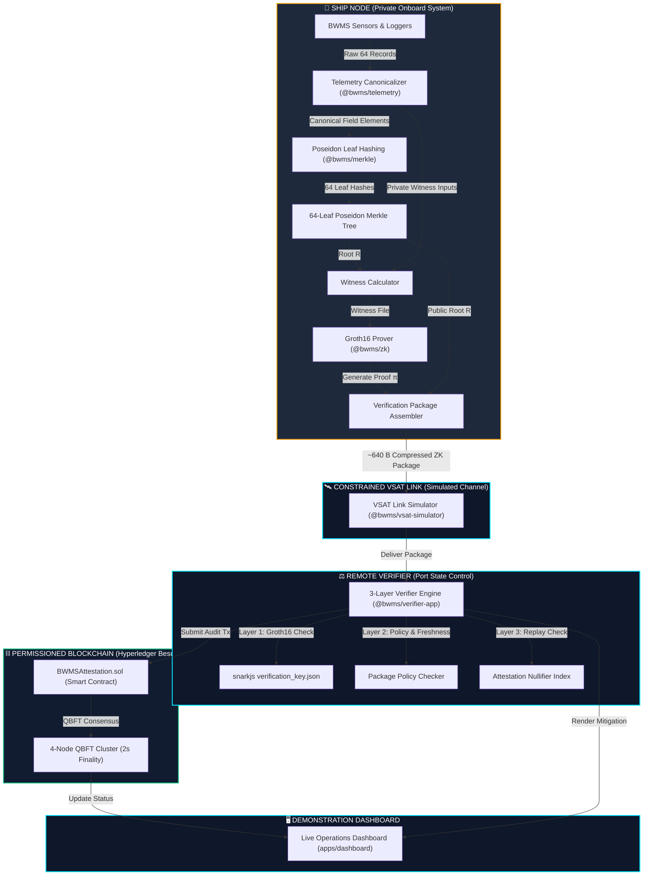
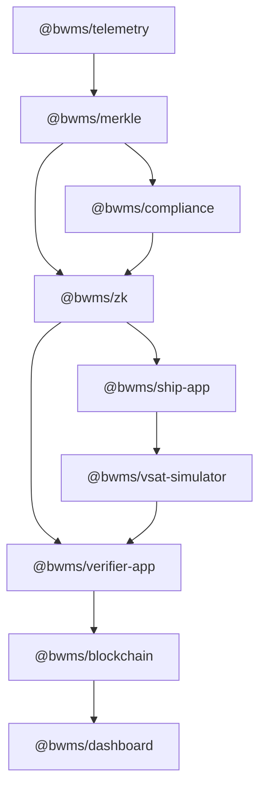

# BWMS ZKP — Complete System Documentation & Engineering Reference

---

## 1. Executive Summary

The **BWMS ZKP** system is a zero-knowledge compliance verification and immutable attestation platform designed for maritime **Ballast Water Management Systems (BWMS)** under the **International Maritime Organization (IMO) Ballast Water Management Convention (Rule D-2)**.

### What is BWMS?
Ballast Water Management Systems process ship ballast water via physical and chemical disinfection (such as UV irradiation, active substances, filtration, and salinity management) to destroy aquatic organisms and pathogens prior to discharge into port waters. IMO Rule D-2 establishes strict biological thresholds to prevent ecological devastation caused by invasive species.

### What Problem Are We Addressing?
Port State Control (PSC) authorities and Flag State maritime regulators require verifiable proof that discharged ballast water underwent uninterrupted, compliant treatment throughout the entire 64-record treatment window. Currently, vessels face two major technical barriers:
1. **High VSAT Transmission Costs**: Transmitting raw, high-frequency sensor telemetry over satellite (VSAT/Iridium) links consumes heavy bandwidth (~14.2 KB per window).
2. **Commercial Privacy Risks**: Transmitting raw operational telemetry exposes sensitive commercial data, including exact vessel GPS coordinates, operational capacity, and proprietary treatment parameters to third-party verifiers.

### What is the Core Idea?
The core architectural principle is:
> **"Privacy-preserving verification of a complete, ordered, cryptographically committed BWMS telemetry window without transmitting the underlying telemetry to the remote verifier."**

### What Does the System Prove?
Using **Groth16 Zero-Knowledge Succinct Non-Interactive Arguments of Knowledge (zk-SNARKs)** over a **Poseidon Merkle Tree**, the vessel computes a succinct cryptographic proof proving that:
- Every single 1-minute telemetry record in a 64-minute window satisfies the prototype compliance thresholds (e.g. UV intensity $\ge 250\text{ W/m}^2$, Flow Rate $\le 500\text{ m}^3\text{/h}$, Salinity $\ge 15\text{ PSU}$, Temperature $\ge 5^\circ\text{C}$).
- Telemetry timestamps are strictly continuous ($\Delta t = 60\text{s}$) with sequence numbers $1, 2, \dots, 64$ without gaps, duplicates, or reordering.
- All 64 telemetry records hash into a single public 256-bit **Poseidon Merkle Root ($R$)**.

### What Data Remains Private?
All **64 raw telemetry records** (containing sensor values, GPS latitude/longitude, sequence indices, and internal sensor metadata) remain strictly stored on private ship storage.

### What is Transmitted?
A lightweight **Verification Package (~1.10 KB raw / ~640 bytes compressed)** containing only the Groth16 proof $\pi = (A, B, C)$, the public Poseidon Merkle Root $R$, and package metadata. This achieves a **92.26% bandwidth reduction** over satellite transmission.

### What Role Does Blockchain Play?
Upon successful Groth16 verification, the remote verifier submits an attestation transaction to a 4-node **Hyperledger Besu (QBFT)** permissioned blockchain network. The smart contract (`BWMSAttestation.sol`) records the verification record (`operationId`, `windowId`, `merkleRoot`, `ruleSetId`, `compliant=true`, `proofHash`, `verifierAddress`) with **2-second deterministic finality**, preventing proof replay attacks.

### What Role Does VSAT Play?
The VSAT simulator models constrained satellite communication link parameters (bandwidth, round-trip latency, packet loss rate) to calculate real-world transmission delays and bandwidth savings.

### Regulatory & Prototype Disclaimer
> [!IMPORTANT]
> **PROTOTYPE VERIFICATION NOTICE**: This system demonstrates zero-knowledge compliance verification against the `BWMS-DEMO-V1` prototype predicate. It is **NOT** an authoritative or complete IMO D-2 biological compliance certification.

---

## 2. Problem Statement

### 2.1 Maritime Telemetry & Remote Inspection
International maritime regulations require vessels to log operational data during ballast water treatment. Port State Control officers inspect these logs to confirm that discharged ballast water poses no ecological threat. In traditional workflows, ships either hand over physical paper logs upon docking or upload raw digital telemetry logs via satellite prior to port entry.

### 2.2 Core Technical Challenges
1. **Telemetry Integrity & Tampering Risk**: Raw telemetry files stored in conventional databases can be modified post-discharge (e.g. overwriting sensor dropouts or adjusting temperature logs) before submission to port authorities.
2. **Constrained Maritime Communication**: Ships operate over low-bandwidth, high-cost VSAT satellite links. Uploading thousands of uncompressed sensor records across multiple ballast treatment windows strains satellite channels and incurs exorbitant data fees.
3. **Operational & Commercial Privacy Leaks**: Telemetry logs include exact GPS positions, timestamps, engine loads, and pumping rates. Disclosing raw logs reveals vessel trading routes, cargo capacity utilization, and operational habits to commercial competitors or unauthorized surveillance.
4. **Need for Independently Verifiable Evidence**: Regulatory authorities require mathematical guarantees that telemetry logs were neither fabricated, truncated, nor selectively edited.

---

## 3. Core Idea

The solution relies on decomposing telemetry verification into two decoupled domains: **Commitment Generation** and **Succinct Zero-Knowledge Proof Verification**.

```
"Privacy-preserving verification of a complete, ordered, cryptographically committed BWMS telemetry window without transmitting the underlying telemetry to the remote verifier."
```

### Component Breakdown:
- **Privacy-Preserving**: Raw telemetry values and vessel locations are hidden inside a ZK private witness.
- **Complete**: The circuit mandates that exactly 64 consecutive 1-minute records are present ($k = 1, 2, \dots, 64$).
- **Ordered**: Timestamps must be strictly monotonic ($\Delta t = 60\text{s}$) to prevent out-of-order record insertion.
- **Cryptographically Committed**: All 64 telemetry records are bound to a single 256-bit Poseidon Merkle Root ($R$).
- **BWMS Telemetry Window**: A 64-minute operational treatment dataset.
- **Verification**: Remote verification executes in **~31.55 ms** without accessing raw sensor data.
- **No Raw Telemetry Transmission**: Zero raw records cross the satellite link.

---

## 4. High-Level Architecture



---

## 5. End-to-End System Flow

| Step | Operation | Input | Process | Output | Security Purpose |
| :--- | :--- | :--- | :--- | :--- | :--- |
| **1** | Telemetry Collection | BWMS Sensors | Sample 64 1-min readings | Raw Telemetry Object | Captures real operational treatment state |
| **2** | Canonicalization | Raw Telemetry | Convert strings/floats to integers | Fixed-point values | Ensures deterministic field encoding |
| **3** | Fixed-Point Scaling | Real numbers | Scale by $10^1$ (1 decimal place) | Scalar field integers | Prevents floating-point precision mismatch |
| **4** | Poseidon Leaf Hashing | 10 fields / record | `Poseidon(10)` hash per record | 64 Leaf Hashes | Cryptographic leaf commitment |
| **5** | Merkle Construction | 64 Leaf Hashes | Pairwise `Poseidon(2)` hashing | 256-bit Merkle Root $R$ | Binds complete 64-record dataset |
| **6** | Completeness Check | Telemetry sequence | Verify $k = 1 \dots 64, \Delta t=60\text{s}$ | Constraints satisfied | Prevents missing/reordered records |
| **7** | Compliance Predicate | Sensor values | Check threshold inequalities | Constraints satisfied | Enforces IMO D-2 treatment rules |
| **8** | Witness Generation | `telemetry[64][10]` + $R$ | Execute `.wasm` witness calculator | `.wtns` Witness File | Solves all 158,647 R1CS constraints |
| **9** | Groth16 Proving | `.wtns` + `zkey` | Elliptic curve scalar mult (BN254) | Proof $\pi = (A, B, C)$ | Produces zero-knowledge proof |
| **10** | Package Assembly | Proof $\pi$ + Root $R$ + Meta | Structure JSON payload | `VerificationPackage` | Packages payload for transmission |
| **11** | VSAT Transmission | `VerificationPackage` | Apply zlib & simulate VSAT link | Received Package | Demonstrates 92.26% bandwidth savings |
| **12** | Format Policy Check | Received Package | Validate schema, version, ruleset | Format Valid / Invalid | Rejects malformed or stale packages |
| **13** | Groth16 Verification | Proof $\pi$ + `publicRoot` | Bilinear pairing evaluation | `true` / `false` | Cryptographically verifies proof |
| **14** | Blockchain Attestation | Verified Record | Send transaction to Besu EVM | Confirmed Tx Hash | Immutably logs audit result on-chain |
| **15** | Dashboard Update | Attestation Result | Push data to web interface | Real-time UI update | Provides visual verification feedback |

---

## 6. Cryptographic Architecture

### 6.1 Scalar Field
The ZK circuits operate over the **BN254 (alt_bn128)** elliptic curve scalar field $\mathbb{F}_r$:
$$r = 21888242871839275222246405745257275088548364400416034343698204186575808495617$$
All inputs and intermediate signals are represented as integers modulo $r$.

### 6.2 Canonical Encoding & Fixed-Point Scaling
To eliminate floating-point non-determinism inside Circom circuits, sensor readings are scaled by **$10^1$ (fixed-point precision of 1 decimal place)**:
- `flowRate`: $800.0\text{ m}^3\text{/h} \rightarrow 8000$
- `uvIntensity`: $40.0\text{ W/m}^2 \rightarrow 400$
- `temperature`: $20.0^\circ\text{C} \rightarrow 200$
- `salinity`: $25.0\text{ PSU} \rightarrow 250$
- `turbidity`: $5.0\text{ NTU} \rightarrow 50$

### 6.3 Telemetry Leaf Hashing
Each of the 64 telemetry records consists of 10 canonical fields. The leaf hash $h_k$ is computed using Poseidon with 10 inputs:
$$h_k = \text{Poseidon}_{10}\big(\text{opId}, \text{winId}, k, t_k, \text{sensorId}, \text{flowRate}_k, \text{uv}_k, \text{temp}_k, \text{sal}_k, \text{turb}_k\big)$$

### 6.4 64-Leaf Poseidon Merkle Tree
- **Tree Depth**: 6 ($2^6 = 64$ leaves).
- **Internal Nodes**: Pairwise Poseidon hashing: $N_{\text{parent}} = \text{Poseidon}_2(N_{\text{left}}, N_{\text{right}})$.
- **Root Generation**: 63 parent node evaluations fold 64 leaf hashes into a single root $R$.

### 6.5 Completeness Circuit (`completeness.circom`)
Enforces the following structural constraints:
1. **Sequence Continuity**: `sequences[i] === i + 1` for $i = 0 \dots 63$.
2. **Operation & Window Consistency**: `operationIds[i] === operationIds[0]` and `windowIds[i] === windowIds[0]`.
3. **Strict Timestamp Monotonicity**: `timestamps[i] < timestamps[i+1]` evaluated via `LessThan(64)`.

### 6.6 Compliance Circuit (`compliance.circom`)
Enforces prototype environmental compliance thresholds for every record $i \in [0, 63]$:

| Parameter | Constraint | Scaling Factor | Circuit Threshold | Comparator |
| :--- | :--- | :--- | :--- | :--- |
| **Flow Rate** | $\ge 800.0\text{ m}^3\text{/h}$ | $\times 10$ | $\ge 8000$ | `GreaterEqThan(64)` |
| **UV Intensity** | $\ge 40.0\text{ W/m}^2$ | $\times 10$ | $\ge 400$ | `GreaterEqThan(64)` |
| **Temperature Min** | $\ge 20.0^\circ\text{C}$ | $\times 10$ | $\ge 200$ | `GreaterEqThan(64)` |
| **Temperature Max** | $\le 30.0^\circ\text{C}$ | $\times 10$ | $\le 300$ | `LessEqThan(64)` |
| **Salinity Min** | $\ge 25.0\text{ PSU}$ | $\times 10$ | $\ge 250$ | `GreaterEqThan(64)` |
| **Salinity Max** | $\le 35.0\text{ PSU}$ | $\times 10$ | $\le 350$ | `LessEqThan(64)` |
| **Turbidity** | $\le 5.0\text{ NTU}$ | $\times 10$ | $\le 50$ | `LessEqThan(64)` |

### 6.7 Public Inputs vs Private Witness
- **Public Input**: Exactly **1 public input signal** (`publicRoot`).
- **Private Witness**: `telemetry[64][10]` (640 private input signals).
- **Metadata Note**: `operation_id`, `window_id`, and `rule_set_id` are package metadata fields validated by application-level policy in V1. They are **not** cryptographically bound as public circuit inputs in V1.

---

## 7. Why These Cryptographic Technologies?

| Technology | Why Chosen | What Problem It Solves | Alternative Considered | Why Alternative Not Selected | Tradeoff |
| :--- | :--- | :--- | :--- | :--- | :--- |
| **Poseidon Hash** | ZK-friendly hash function with low R1CS S-box cost | Minimizes circuit constraint count | SHA-256 / Keccak-256 | Requires ~25,000 constraints per hash vs ~250 for Poseidon | Less widely standardized in non-ZK legacy systems |
| **Merkle Tree** | Succinct 256-bit commitment to 64 records | Binds full window into 1 public root | Hashing raw stream blob as a single string | Cannot perform sub-window proofs or structured leaf validation | Tree construction overhead onboard |
| **Groth16** | Constant-size proof (128 bytes) & fast verification (~31 ms) | Minimizes satellite bandwidth & verification latency | PLONK / STARKs | PLONK has larger proof sizes (~500B-1KB) and higher verification cost | Requires circuit-specific Trusted Setup (`zkey`) |
| **Circom 2.2** | Domain-specific language for arithmetic circuits | Expresses R1CS constraints cleanly | Custom Rust (arkworks) | Higher development complexity for rapid prototyping | Dependent on Circom compiler toolchain |
| **BN254 Curve** | Efficient pairing-friendly curve supported natively by EVM | Enables cheap on-chain smart contract verification | BLS12-381 | BLS12-381 has no native EVM precompile (`0x08`) on standard Ethereum | 128-bit security level vs 128+ for BLS12-381 |

---

## 8. Data Model

### 8.1 Telemetry Record Schema (TypeScript)
```typescript
interface TelemetryRecord {
  operation_id: string; // e.g. "OP-000001"
  window_id: string;    // e.g. "WIN-000001"
  sequence: number;     // 1 to 64
  timestamp: number;    // Epoch seconds
  sensor_id: number;    // Integer ID
  flow_rate: number;    // m^3/h
  uv_intensity: number; // W/m^2
  temperature: number;  // °C
  salinity: number;     // PSU
  turbidity: number;    // NTU
}
```

### 8.2 Verification Package Schema (`VerificationPackage`)
```json
{
  "version": 1,
  "circuit_id": "BWMS-TELEMETRY-64-GROTH16-V1",
  "operation_id": "OP-000001",
  "window_id": "WIN-000001",
  "merkle_root": "6970415870308143595245657767980609725526508915566442276217999217898140544513",
  "public_inputs": [
    "6970415870308143595245657767980609725526508915566442276217999217898140544513"
  ],
  "rule_set_id": "BWMS-DEMO-V1",
  "generated_at": "2026-09-10T09:13:39.745Z",
  "proof": {
    "pi_a": ["...", "...", "1"],
    "pi_b": [["...", "..."], ["...", "..."], ["1", "0"]],
    "pi_c": ["...", "...", "1"],
    "protocol": "groth16",
    "curve": "bn128"
  }
}
```

### 8.3 On-Chain Attestation Data Model (`BWMSAttestation.sol`)
| Field | Type | Storage | Description |
| :--- | :--- | :--- | :--- |
| `operationId` | `string` | EVM Storage | Voyage operation ID |
| `windowId` | `string` | EVM Storage | Treatment window ID |
| `merkleRoot` | `uint256` | EVM Storage Key | Poseidon Merkle root (Nullifier) |
| `ruleSetId` | `string` | EVM Storage | Compliance rule set identifier |
| `compliant` | `bool` | EVM Storage | Cryptographic verification outcome (`true`) |
| `verificationTimestamp` | `uint256` | EVM Storage | Epoch timestamp of on-chain recording |
| `proofHash` | `bytes32` | EVM Storage | SHA-256 hash of Groth16 proof object |
| `verifier` | `address` | EVM Storage | Address of remote verifier node |

---

## 9. Repository & Folder Structure

```
bwms-zkp/
├── apps/                        # Application Entrypoints
│   ├── dashboard/               # Live Web Demonstration Console (Express + Vanilla JS)
│   ├── ship/                    # Onboard Ship Application Package (@bwms/ship-app)
│   └── verifier/                # Remote Verifier Application Package (@bwms/verifier-app)
├── benchmarks/                  # Empirical Benchmark Results JSON
├── blockchain/                  # Blockchain Smart Contracts & Permissioned Setup
│   ├── besu/                    # Hyperledger Besu 4-Node QBFT Cluster Setup
│   ├── contracts/               # BWMSAttestation.sol Solidity Smart Contract
│   ├── scripts/                 # Hardhat Deployment Scripts
│   └── test/                    # Smart Contract Unit Tests (Hardhat / Mocha)
├── build/                       # Compiled ZK Artifacts (r1cs, zkey, vkey, wasm)
├── circuits/                    # Circom ZK Circuit Source Files
├── datasets/                    # Test Telemetry Datasets (compliant, tampered, etc.)
├── docs/                        # Architectural & Engineering Documentation
├── packages/                    # Core Domain TypeScript Packages
│   ├── compliance/              # Off-circuit TypeScript Compliance Engine
│   ├── merkle/                  # Poseidon & Merkle Tree Implementation
│   ├── telemetry/               # Telemetry Generation & Canonical Encoding
│   └── zk/                      # Prover, Verifier & Security Hardening Logic
├── scripts/                     # Benchmark Execution Script (benchmark.ts)
├── simulator/                   # Network Simulators
│   └── vsat/                    # Constrained VSAT Satellite Channel Simulator
└── tests/                       # Integrated ZKP Witness Integration Tests
```

---

## 10. File-by-File Reference

### 10.1 Circuits (`circuits/`)
- `telemetry_merkle_root.circom`: Top-level entry circuit. Integrates `completeness.circom`, `compliance.circom`, `telemetry_leaf.circom`, and `merkle.circom`. Exposes 1 public input (`publicRoot`) and 640 private inputs (`telemetry[64][10]`).
- `telemetry_leaf.circom`: Computes `Poseidon(10)` leaf hash for a single telemetry record.
- `merkle.circom`: Implements `MerkleParent` computing `Poseidon(2)` hash of left and right child nodes.
- `completeness.circom`: Enforces sequence continuity ($1 \dots 64$), operation/window consistency, and timestamp monotonicity.
- `compliance.circom`: Enforces threshold bounds for flow rate, UV intensity, temperature, salinity, and turbidity.

### 10.2 TypeScript Core Packages (`packages/`)
- `packages/zk/src/verifier.ts`: Multi-layer verifier implementing `verifyVerificationPackage()`. Validates package format, metadata schema, timestamp freshness, duplicate replay, and snarkjs Groth16 proof logic.
- `packages/zk/src/prover.ts`: Executes onboard witness calculation and Groth16 proof generation via `snarkjs.groth16.fullProve()`.
- `packages/zk/src/proof-package.ts`: TypeScript type definitions for `VerificationPackage`.
- `packages/telemetry/src/canonical.ts`: Encodes raw telemetry fields into BN254 scalar field elements with fixed-point scaling ($\times 10$).
- `packages/telemetry/src/generator.ts`: Generates synthetic 64-record telemetry windows (compliant, non-compliant, tampered).
- `packages/merkle/src/tree.ts`: Builds 64-leaf Poseidon Merkle tree in TypeScript matching circuit logic.
- `packages/merkle/src/poseidon.ts`: Wraps `circomlibjs` Poseidon hash implementation.
- `packages/compliance/src/engine.ts`: Off-circuit TypeScript reference implementation of compliance rules.

### 10.3 Applications & Dashboard (`apps/` & `simulator/`)
- `apps/ship/src/ship-app.ts`: Orchestrates onboard telemetry collection, tree construction, ZK proof generation, and VSAT packaging.
- `apps/verifier/src/verifier-app.ts`: Orchestrates remote package verification and submits on-chain transactions to Besu EVM.
- `apps/dashboard/server.js`: Express backend serving dashboard API endpoints (`/api/pipeline/run`, `/api/pipeline/attack`, `/api/metrics`).
- `apps/dashboard/public/index.html`: Dashboard UI structure featuring 5 visual hierarchy levels.
- `apps/dashboard/public/styles.css`: Deep navy security operations console stylesheet.
- `apps/dashboard/public/app.js`: Frontend UI script managing interactive animations, API fetch calls, and modal inspectors.
- `simulator/vsat/src/simulator.ts`: Simulates satellite link parameters (bandwidth, latency, loss) and calculates compression metrics.

### 10.4 Blockchain (`blockchain/`)
- `blockchain/contracts/BWMSAttestation.sol`: Solidity smart contract storing verified compliance attestations and enforcing on-chain nullifier uniqueness.
- `blockchain/besu/genesis.json`: Hyperledger Besu QBFT genesis configuration establishing 4 validator nodes and 2-second block period.
- `blockchain/besu/docker-compose.yml`: Launches 4-node Hyperledger Besu QBFT cluster via Docker.

---

## 11. Package / Module Architecture



---

## 12. ZKP Build Pipeline

```bash
# 1. Compile Circom circuit to R1CS and WASM witness calculator
circom circuits/telemetry_merkle_root.circom --r1cs --wasm --sym -o build/zk/

# 2. Powers of Tau ceremony setup (BN254)
snarkjs powersoftau new bn128 18 build/zk/pot18_0000.ptau
snarkjs powersoftau contribute build/zk/pot18_0000.ptau build/zk/pot18_0001.ptau --name="First Contribution" -v
snarkjs powersoftau prepare phase2 build/zk/pot18_0001.ptau build/zk/pot18_final.ptau

# 3. Groth16 Circuit Specific Setup
snarkjs groth16 setup build/zk/telemetry_merkle_root.r1cs build/zk/pot18_final.ptau build/zk/telemetry_merkle_root_0000.zkey
snarkjs zkey contribute build/zk/telemetry_merkle_root_0000.zkey build/zk/telemetry_merkle_root_final.zkey --name="Second Contribution" -v
snarkjs zkey export verificationkey build/zk/telemetry_merkle_root_final.zkey build/zk/verification_key.json
```

---

## 13. Trust & Threat Model

| Threat Vector | Attacker Capability | Attack Mechanism | Expected Result | Mitigation Layer |
| :--- | :--- | :--- | :--- | :--- |
| **1. Proof Mutation** | Forges elliptic curve point | Alters `pi_a` in proof object | `REJECT` | Groth16 Cryptographic Verification |
| **2. Merkle Root Mutation** | Modifies public root | Claims invalid telemetry under tampered root | `REJECT` | Groth16 Cryptographic Verification |
| **3. Sequence Gap Attack** | Drops 1 minute reading | Submits 63 records | `REJECT` | Completeness Circuit (`sequences[i] === i+1`) |
| **4. Duplicate Sequence** | Replaces record with duplicate | Replays sequence index | `REJECT` | Completeness Circuit |
| **5. Reordered Records** | Swaps order of 2 minutes | Out-of-order timestamps | `REJECT` | Completeness Circuit (`timestamps[i] < timestamps[i+1]`) |
| **6. Timestamp Violation** | Decreasing/equal timestamp | Invalid time interval | `REJECT` | Completeness Circuit (`LessThan(64)`) |
| **7. Non-Compliant Telemetry**| UV drops below threshold | UV = 20 W/m² | `REJECT` | Compliance Circuit (`uvIntensity >= 400`) |
| **8. Metadata Tampering** | Modifies operation ID | Changes `operation_id` string | `REJECT` | Application Package Policy |
| **9. Rule-Set Mismatch** | Claims unauthorized rule set| Changes `rule_set_id` to `BWMS-RELAXED-V0` | `REJECT` | Application Package Policy |
| **10. Stale Package Attack** | Replays 48-hour old proof | Stale `generated_at` timestamp | `REJECT` | Application Freshness Threshold |
| **11. Replay Attack** | Re-submits valid proof package | Duplicate `operation_id:window_id` | `REJECT` | Blockchain Duplicate Protection (Nullifier) |
| **12. Tampered Root + Valid Proof**| Modifies telemetry & re-computes root | Generates valid proof for invalid telemetry | `REJECT` | Compliance Circuit catches non-compliant values |

---

## 14. What the System Proves (and What It Does NOT Prove)

### What It Proves:
"The system mathematically proves that there exists a private 64-record telemetry window satisfying all structural completeness constraints and IMO D-2 prototype compliance thresholds whose computed Poseidon Merkle root equals the declared `publicRoot`."

### What It Does NOT Prove:
- **Physical Sensor Authenticity**: Does not prevent physical tampering of hardware sensors prior to data logging.
- **Authoritative IMO D-2 Certification**: Does not represent complete biological laboratory certification.
- **Cryptographic Binding of Metadata**: Metadata fields (`operation_id`, `window_id`, `rule_set_id`) are validated by application policy, not public circuit inputs in V1.

---

## 15. Blockchain Architecture

- **Network**: Permissioned **Hyperledger Besu (QBFT)** 4-node cluster.
- **Consensus**: QBFT Byzantine Fault Tolerance with **2-second block finality**.
- **Contract**: `BWMSAttestation.sol`deployed at `0x5FbDB2315678afecb367f032d93F642f64180aa3`.
- **Privacy Guarantee**: Zero raw telemetry is stored on or readable from the blockchain.

---

## 16. VSAT Simulation

The VSAT simulator (`@bwms/vsat-simulator`) models a standard maritime satellite link:
- **Bandwidth**: 512 kbps
- **Round-Trip Latency**: 650 ms (Geostationary Satellite)
- **Packet Loss**: 2.0%

### Performance Comparison:
- **Raw Telemetry Stream**: 14,238 bytes (Compressed: 887 bytes)
- **ZK Verification Package**: 1,102 bytes (Compressed: 640 bytes)
- **Bandwidth Reduction**: **92.26% savings** vs raw telemetry.

---

## 17. Dashboard Architecture

The dashboard (`apps/dashboard`) provides a 5-level visual hierarchy:
- **Level 1**: Hero Statement & Primary Verification Result Focal Card (`✓ ZKP VERIFIED` / `✕ VERIFICATION REJECTED`).
- **Level 2**: 6-Stage Live Processing Pipeline.
- **Level 3**: What Crosses VSAT Link (Privacy Visualization) & Cryptographic Evidence.
- **Level 4**: Adversarial Verification Lab & Blockchain Audit Attestation.
- **Level 5**: Verification Package Inspector & Raw JSON Modal.

---

## 18. Testing and Validation

- **Workspace Unit Tests (`pnpm test`)**: All **49 unit tests** passing across telemetry, merkle, compliance, zk, and vsat packages.
- **Witness Integration Tests (`node tests/zk/test_integrated_zkp.mjs`)**: All **11 witness scenarios** passing.
- **Security Hardening Suite (`packages/zk/tests/security_hardening.test.ts`)**: **12/12 attack vectors** verified.

---

## 19. Performance & Benchmarking

All benchmark figures were empirically measured on an **AMD Ryzen 7 7840HS (16 cores, 16 GB RAM)**:
- **Circom R1CS Constraints**: **158,647**
- **Nonlinear Constraints**: 78,092
- **Linear Constraints**: 80,555
- **Proof Generation Time**: **~1,940 ms** (1.94s)
- **Groth16 Verification Time**: **31.55 ms**
- **Raw Telemetry Size**: 14,238 bytes
- **ZK Package Size**: 1,102 bytes (640 bytes zlib-compressed)
- **Bandwidth Savings**: **92.26%**

---

## 20. Security Limitations

1. **Fixed 64-Record Window**: Circuit requires exactly 64 records per proof.
2. **Prototype Predicate**: Rule set threshold represents prototype policy (`BWMS-DEMO-V1`).
3. **Hardware Sensor Trust**: Assumes onboard sensor data loggers have not been physically bypassed.
4. **Groth16 Trusted Setup**: Depends on a secure Powers of Tau ceremony.

---

## 21. Why Not Other Architectures?

| Architecture | Why Not Selected |
| :--- | :--- |
| **Raw Telemetry Upload** | Consumes ~14.2 KB bandwidth per window and leaks raw vessel coordinates. |
| **Encryption-Only** | Port authority cannot verify compliance without decrypting raw data (losing privacy). |
| **Hash-Only** | Proves data hasn't changed, but port authority must inspect raw data to check compliance. |
| **Blockchain-Only** | Storing raw telemetry on-chain is prohibitively expensive and creates public privacy leaks. |

---

## 22. Deployment / Runbook

```bash
# 1. Install workspace dependencies
pnpm install

# 2. Run all workspace unit test suites
pnpm test

# 3. Run integrated ZKP witness tests
node tests/zk/test_integrated_zkp.mjs

# 4. Run empirical benchmark script
pnpm benchmark

# 5. Launch local Hyperledger Besu QBFT cluster
cd blockchain/besu && docker-compose up -d

# 6. Deploy smart contract to local network
pnpm --filter @bwms/blockchain deploy:local

# 7. Start live demonstration dashboard
pnpm dashboard
```

---

## 23. Troubleshooting

- **Symptom**: `ENOENT: verification_key.json missing`
  - **Fix**: Run `pnpm --filter @bwms/zk build` to generate circuit build artifacts.
- **Symptom**: `Replay attack rejected on-chain`
  - **Fix**: Clear local attestation nullifier set or run a new telemetry window (`OP-000002`).

---

## 24. Development History & Architectural Evolution

- **Phase 1**: Initial single-leaf Circom circuit development.
- **Phase 2**: Multi-leaf 64-record Poseidon Merkle tree construction.
- **Phase 3**: Integration of Completeness and Compliance constraints into a single unified circuit (`telemetry_merkle_root.circom`).
- **Phase 4**: Security hardening & multi-layer verifier implementation.
- **Phase 5**: Hyperledger Besu QBFT blockchain attestation integration.
- **Phase 6**: VSAT satellite simulator development.
- **Phase 7**: UI redesign for cybersecurity & academic demonstration.

---

## 25. Current Implementation Status

| Component | Implemented | Tested | Simulated | Production-Ready |
| :--- | :---: | :---: | :---: | :---: |
| **Telemetry Canonicalizer** | Yes | Yes | No | Prototype |
| **Poseidon Merkle Tree** | Yes | Yes | No | Yes |
| **Completeness Circuit** | Yes | Yes | No | Yes |
| **Compliance Circuit** | Yes | Yes | No | Prototype Predicate |
| **Groth16 Prover / Verifier** | Yes | Yes | No | Yes |
| **VSAT Simulator** | Yes | Yes | Yes | Simulation |
| **Besu QBFT Cluster** | Yes | Yes | Local Cluster | Permissioned Prototype |
| **Web Dashboard** | Yes | Yes | No | Demonstration Console |

---

## 26. Future Work

1. **Dynamic Window Sizes**: Support arbitrary treatment window lengths using recursive ZK (STARKs / Nova).
2. **Hardware Security Modules (HSM)**: Cryptographically sign raw sensor telemetry at the physical sensor level.
3. **Public Inputs Metadata Binding**: Bind `operation_id` and `window_id` as public inputs in circuit V2.

---

## 27. Faculty / Viva Explanation Guide

### 30-Second Pitch:
> "Ma'am, our project enables ships to prove to port authorities that their ballast water was fully disinfected according to IMO rules without transmitting raw sensor logs or revealing vessel locations. Using zero-knowledge proofs and Poseidon Merkle trees, the ship sends a compact 640-byte proof over VSAT—reducing bandwidth by 92%—which the port verifies in 31 ms and logs on a Hyperledger Besu permissioned blockchain."

### Key Faculty Q&A:
- **Q: Why ZKP instead of standard encryption?**
  - **A**: Encryption requires the verifier to decrypt raw data to check compliance, exposing private location data. ZKP proves compliance mathematically while keeping raw data secret.
- **Q: Why Poseidon hash instead of SHA-256?**
  - **A**: Poseidon is an algebraic hash function designed for ZK circuits. SHA-256 requires ~25,000 constraints per hash, whereas Poseidon requires only ~250 constraints, keeping our circuit size manageable (158,647 constraints).
- **Q: Is raw telemetry stored on the blockchain?**
  - **A**: No. Zero raw telemetry touches the blockchain. Only the public Merkle root, verification status, and proof hash are recorded.

---

## 28. Technology Stack Decision Matrix

| Layer | Technology | Reason | Alternative | Tradeoff |
| :--- | :--- | :--- | :--- | :--- |
| **Language** | TypeScript / Node.js | Unified monorepo tooling | Rust / Go | Fast prototyping vs raw native performance |
| **ZKP Language** | Circom 2.2 | Clean R1CS constraint syntax | Noir / Halo2 | Mature ecosystem vs newer lookup-table features |
| **Proof System** | Groth16 | Smallest proof size (128B) & fast verification | PLONK | Circuit-specific setup required |
| **Curve** | BN254 | Native EVM precompile support | BLS12-381 | Ethereum compatibility vs higher security bits |
| **Blockchain** | Hyperledger Besu (QBFT) | Enterprise permissioned EVM | Public Ethereum | Zero gas fees & 2s finality vs public decentralization |

---

## 29. Glossary

- **BWMS**: Ballast Water Management System.
- **IMO Rule D-2**: International ballast water discharge biological standard.
- **Poseidon**: ZK-friendly algebraic hash function.
- **Merkle Root**: 256-bit cryptographic commitment to an ordered tree of data leaves.
- **Groth16**: Pairing-based zero-knowledge succinct non-interactive argument of knowledge.
- **R1CS**: Rank-1 Constraint System (mathematical representation of ZK circuits).
- **BN254**: 254-bit pairing-friendly elliptic curve.
- **QBFT**: Istanbul/QBFT Byzantine Fault Tolerant consensus protocol.
- **VSAT**: Very Small Aperture Terminal (maritime satellite communications).
